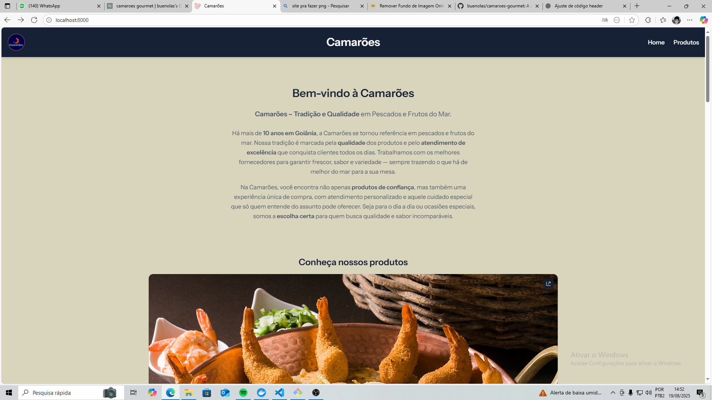

# Camarões 🦐


A premium seafood store website under development, showcasing **fresh fish and seafood products** with a modern, responsive design.

---

## Table of Contents

- [Project Overview](#project-overview)
- [Purpose](#purpose)
- [Current Status](#current-status)
- [Modules](#modules)
- [Video Demonstration](#video-demonstration)
- [Technologies](#technologies)
- [Getting Started](#getting-started)
- [Contribution](#contribution)
- [License](#license)
- [Contact](#contact)

---

## Project Overview

**Camarões** is a website in progress, built to present a seafood store in Goiânia, Brazil.  
The website combines a **responsive front-end** with a **functional API backend**, allowing dynamic content and a smooth user experience.

  
*Above: Preliminary home page design.*

---

## Purpose

The project aims to:

- Showcase fresh seafood and fish products.
- Highlight the store's 10-year tradition and quality commitment.
- Provide contact information, location, and operating hours.
- Deliver an engaging and professional user experience with animations and responsive layout.

---

## Current Status

- ✅ **API**: Fully functional backend with product endpoints.  
- ✅ **Home Page**: Complete responsive design, sections for introduction, products, gallery, location, FAQ, and contact.  
- ⚙️ **In progress**: Product page, where showcases the catalog.

---

## Modules

### Home Page
- Hero section with store branding and logo.
- Welcome text and store description.
- Redirects to product page.
- Gallery and store location.
- Operating hours and FAQ section.
- Contact form and store details.

### API
- RESTful endpoints for products, categories, and other store data.
- Prepared for future user authentication and dynamic operations.

### Video Demonstration
Here is a **video walkthrough of the home page**:

https://github.com/user-attachments/assets/e9204384-8024-4f05-80c6-6de97166325a


---

## Technologies


---

## Getting Started

### Prerequisites
- Node.js >= 18
- PHP >= 8.2
- Composer
- PostgreSQL
- Docker (optional for containers)

### Installation
```bash
git clone https://github.com/buenolas/camaroes-gourmet.git
cd camaroes-gourmet
composer install
npm install
cp .env.example .env
php artisan migrate --seed
npm run dev
php artisan serve
````

Access the website at `http://localhost:8000`.

---

## Contribution

Contributions are welcome! Submit pull requests for bug fixes, new features, or improvements. Follow standard GitHub contribution guidelines.

---

## Contact

**Camarões**
Website under development – Goiânia, Brazil
For inquiries or project details, contact the owner or visit the store.
